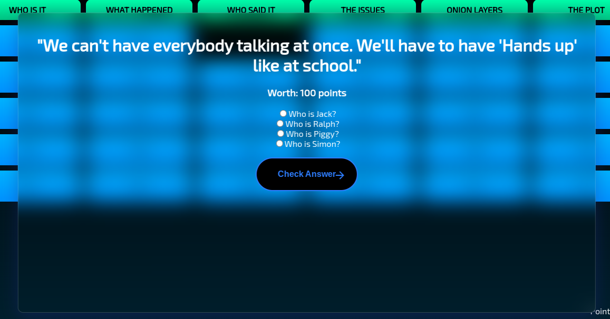

# Lord of the Flies by William Golding - Jeopardy Game

> This was made for a project in my English class.

## Why did I make this?
I have been wanting to make a Jeopardy styled game with HTML JS and CSS for a long time now. I have finally been able to do this with the project we did in English. This has been a learning experience for me and I have learned quite a bit more HTML. Below is a snippet of code from this project.

Below is the HTML code for the question overlay. (Image below)
```HTML
<div id="qoverlay">
    <h1 id="qoverlay_question">Q</h1>
    <h3 id="qoverlay_pointval">pts</h3>
    <center>

      <input type="radio" id="Q1" name="qoverlay_answer" value="1" class="input"><label id="qoverlay_q1text"
        for="Q1"></label><br>
      <input type="radio" id="Q2" name="qoverlay_answer" value="2" class="input"><label id="qoverlay_q2text"
        for="Q2"></label><br>
      <input type="radio" id="Q3" name="qoverlay_answer" value="3" class="input"><label id="qoverlay_q3text"
        for="Q3"></label><br>
      <input type="radio" id="Q4" name="qoverlay_answer" value="4" class="input"><label id="qoverlay_q4text"
        for="Q4"></label>
      <br>
      <br>
      <!-- <button id="qoverlay_checkbutton" onclick="checkAnswer()">
      Check Answer
    </button> -->
      <button onclick="checkAnswer()" id="qoverlay_checkbutton" class="animated-button">
        <svg viewBox="0 0 24 24" class="arr-2" xmlns="http://www.w3.org/2000/svg">
          <path
            d="M16.1716 10.9999L10.8076 5.63589L12.2218 4.22168L20 11.9999L12.2218 19.778L10.8076 18.3638L16.1716 12.9999H4V10.9999H16.1716Z">
          </path>
        </svg>
        <span class="text">Check Answer</span>
        <span class="circle"></span>
        <svg viewBox="0 0 24 24" class="arr-1" xmlns="http://www.w3.org/2000/svg">
          <path
            d="M16.1716 10.9999L10.8076 5.63589L12.2218 4.22168L20 11.9999L12.2218 19.778L10.8076 18.3638L16.1716 12.9999H4V10.9999H16.1716Z">
          </path>
        </svg>
      </button>


      <!-- <button id="qoverlay_checkbutton" onclick="checkAnswer()">Check</button> -->
    </center>
  </div>
```


I mainly made this project because I like watching Jeopardy and trying to answer some of the questions myself, which usually doesn't go well.


Thank you to my english teacher for giving me this oppourtunity ❤